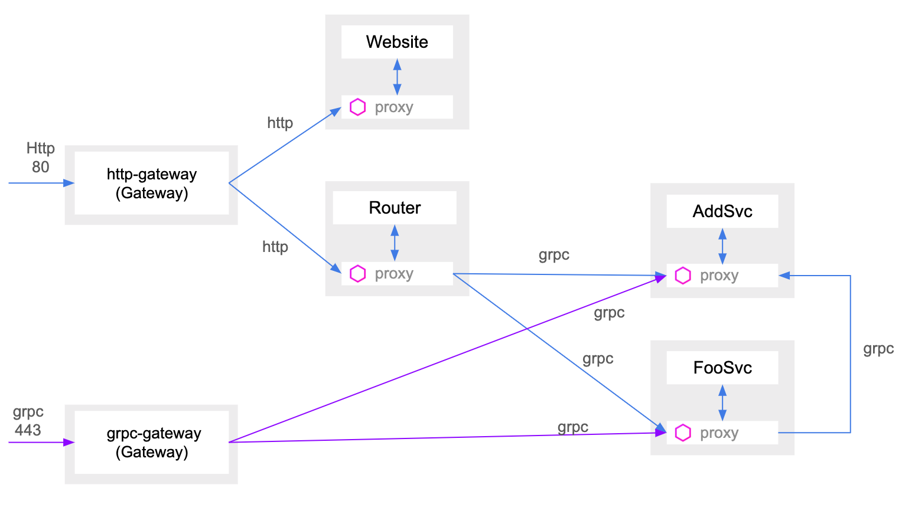

<h1 align="center">Welcome to gokitistiok8s 👋</h1>

> build go microservice with istio at kubernetes

## Architecture

The gokitistiok8s is comprised of 3 micorservice

1. Router
    - http
    - grpc
2. AddSvc
    - sum (http/grpc)
    - concat (http/grpc)
3. FooSvc
    - foo (http/grpc)




## Dependency

> https://github.com/istio/istio isio 官方repository

### 安裝方式

```sh
$ git clone git@github.com:istio/istio.git
# checkout to some release tag, now we use 1.3.5
$ cd istio
$ git checkout 1.3.5

$ helm install install/kubernetes/helm/istio-init --name istio-init --namespace istio-system
# Wait for all Istio CRDs to be created (until 23 crd created):
$ kubectl get crds | grep 'istio.io' | wc -l
$ helm install --set tracing.enabled=true --set disablePolicyChecks=false --set pilot.traceSampling=100.0 install/kubernetes/helm/istio --name istio --namespace istio-system

# enable istio sidecar inject for default namespace
$ kubectl label namespace default istio-injection=enabled
```


## Install

```sh
$ skaffold run
```


## Usage

### local test

```sh
$ make rest_sum
curl -X "POST" "http://<your-ip-host>/api/v1/add/sum" -H 'Content-Type: application/json; charset=utf-8' -d '{ "a": 3, "b": 34}'
{"apiVersion":"","data":{"rs":37}}

$ make rest_concat
curl -X "POST" "http://<your-ip-host>/api/v1/add/concat" -H 'Content-Type: application/json; charset=utf-8' -d '{ "a": "3", "b": "34"}'
{"apiVersion":"","data":{"rs":"334"}}

$ make rest_foo
curl -X "POST" "http://<your-ip-host>/api/v1/foo/foo" -H 'Content-Type: application/json; charset=utf-8' -d '{"s": "foo"}'
{"apiVersion":"","data":{"res":"foo bar"}}

$ make grpc_sum
grpcurl -plaintext -proto ./pb/addsvc/addsvc.proto -d '{"a": 3, "b":5}' <your-ip-host>:443 pb.Addsvc.Sum
{
  "rs": "8"
}

$ make grpc_concat
grpcurl -plaintext -proto ./pb/addsvc/addsvc.proto -d '{"a": "3", "b":"5"}' <your-ip-host>:443 pb.Addsvc.Concat
{
  "rs": "35"
}

$ make grpc_foo
grpcurl -plaintext -proto ./pb/foosvc/foosvc.proto -d '{"s": "foo"}' <your-ip-host>:443 pb.Foosvc.Foo
{
  "res": "foo bar"
}
```

## Test

```sh
$ make test
```

## Quick build a squaresvc service by gk
> [cage1016/gk: Go-Kit Genetator](https://github.com/cage1016/gk) is a gokit go generator
```sh
$ make new_squaresvc
```

### go run new squaresvc service

```sh
$ go run cmd/squaresvc/main.go
level=info ts=2019-12-16T07:28:56.721166Z caller=main.go:134 service=squaresvc protocol=HTTP exposed=8180
level=info ts=2019-12-16T07:28:56.721355Z caller=main.go:147 service=squaresvc protocol=GRPC exposed=8181
```

### test

```sh
$ curl -X POST localhost:8180/square -d '{"s":22}'
{"apiVersion":"1.0","data":{"res":484,"err":null}}

$ grpcurl -plaintext -proto ./pb/squaresvc/squaresvc.proto -d '{"s": 3}' localhost:8181 pb.Squaresvc.Square
{
  "res": "9"
}
```